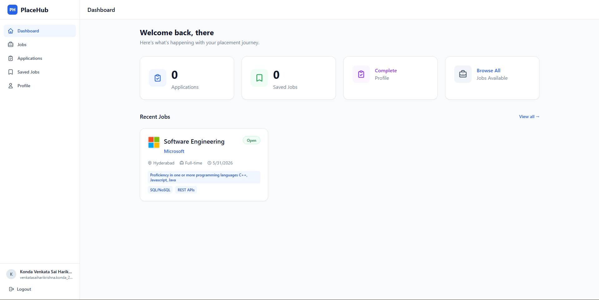
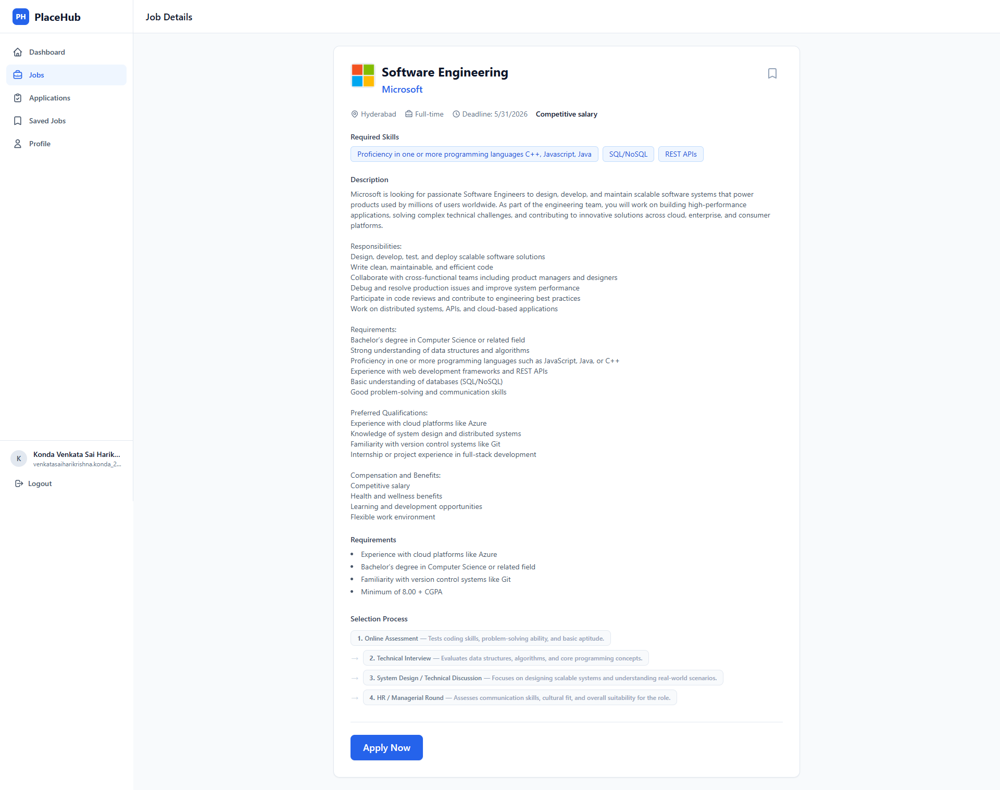
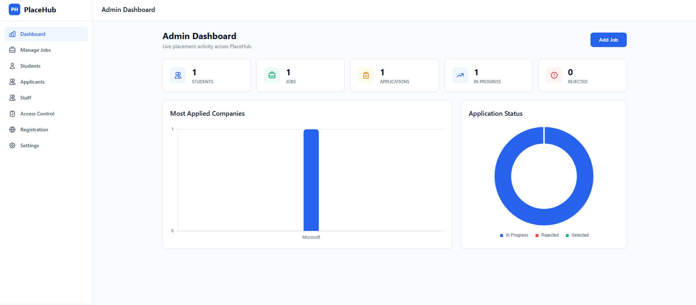
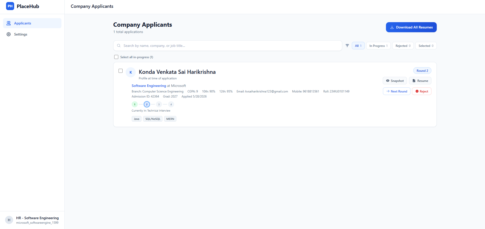

# PlaceHub – Job & Internship Portal

PlaceHub is a full-stack placement management platform designed to streamline the campus recruitment process for students, recruiters, and administrators. It centralizes job postings, applications, resume management, and multi-stage hiring workflows into a single system, replacing manual and fragmented processes.

---

## Overview

The platform is built with a strong focus on backend architecture, data consistency, and real-world workflow handling. It supports multiple user roles (Student, HR, Admin) with fine-grained access control and is designed to handle concurrent usage during active placement cycles.

---

## Key Features

### Authentication & Security

* JWT-based authentication
* Password hashing and secure session handling
* OTP-based verification and password reset

### Role-Based Access Control (RBAC)

* Separate roles for Students, HRs, and Admins
* Protected routes and permission-based access

### Resume Management System

* Single resume per user with overwrite support
* Secure upload, preview, and download
* Automatic cleanup on user deletion (Cloudflare R2)

### Job & Application Management

* Job posting and management
* Application tracking with status updates (shortlist/reject/select)
* Prevention of duplicate applications

### Multi-Round Hiring Workflow

* Support for multiple hiring stages
* Consistent state handling across updates

### Concurrency Handling

* Handles simultaneous HR/admin actions
* Maintains data consistency across workflows

### Admin Features

* Staff management
* Registration controls
* Bulk operations

### Audit Logging

* Tracks critical system actions

---

## Architecture

The backend follows a modular architecture with clear separation of concerns:

Routes → Controllers → Services → Models

Additional design considerations:

* Centralized error handling
* Structured logging system
* Middleware-based validation and authentication
* Rate limiting for sensitive endpoints

---

## Project Structure

### Frontend (React)

```
client/src/
├── components/        # UI components (admin, applicant, job, layout, common)
├── pages/             # Application pages
├── routes/            # Protected and role-based routing
├── services/          # API communication layer
├── hooks/             # Custom React hooks
├── context/           # Global state (Auth)
├── utils/             # Utilities (RBAC, constants)
```

### Backend (Node.js + Express)

```
server/
├── controllers/       # Request handlers
├── services/          # Business logic
├── models/            # Database schemas
├── routes/            # API routes
├── middleware/        # Auth, validation, rate limiting
├── config/            # DB, logger, email, Redis
├── utils/             # Helper functions
├── queues/            # Background jobs
├── workers/           # Queue workers
├── validators/        # Request validation
├── scripts/           # Data scripts and cleanup
```

---

## Tech Stack

### Frontend

* React.js
* Context API
* Custom Hooks

### Backend

* Node.js
* Express.js
* MongoDB (Mongoose)

### Services & Tools

* Cloudflare R2 (file handling)
* Redis + BullMQ (background jobs)
* JWT Authentication
* Logging and error handling system

---

## Performance & Scalability

* Indexed queries for faster data retrieval
* Pagination for large datasets
* Rate limiting for sensitive APIs
* Optimized file storage and cleanup
* Designed to handle concurrent users (students, HRs, admins)

---

## Security

* Input validation and sanitization
* JWT-based authentication
* Role-based route protection
* Rate limiting on critical endpoints
* Secure file handling

---

## Getting Started

### Prerequisites

* Node.js
* MongoDB
* Cloudflare R2 account
* Redis

### Installation

```bash
git clone https://github.com/SaiHariKrishna/Placehub-Beta.git

cd server
npm install

cd ../client
npm install
```

### Environment Variables

Create a `.env` file in the `server` directory:

```
MONGO_URI=
JWT_SECRET=

REDIS_URL=
EMAIL_CONFIG=
```

### Run the Application

```bash
# Backend
cd server
npm run dev

# Frontend
cd client
npm run dev
```

---

## Screenshots

### Student Dashboard


### Job Listings


### Admin Panel


### Application Tracking


## Highlights

* Designed a real-world placement workflow system
* Implemented RBAC with fine-grained permissions
* Built a controlled resume storage system
* Handled concurrent operations with data consistency
* Applied modular backend architecture and logging system

---

## Author

Abhishek Reddy Kotha

---

## Note

This project is primarily focused on backend architecture, system design, and handling real-world workflows, with emphasis on scalability, data consistency, and reliability.
